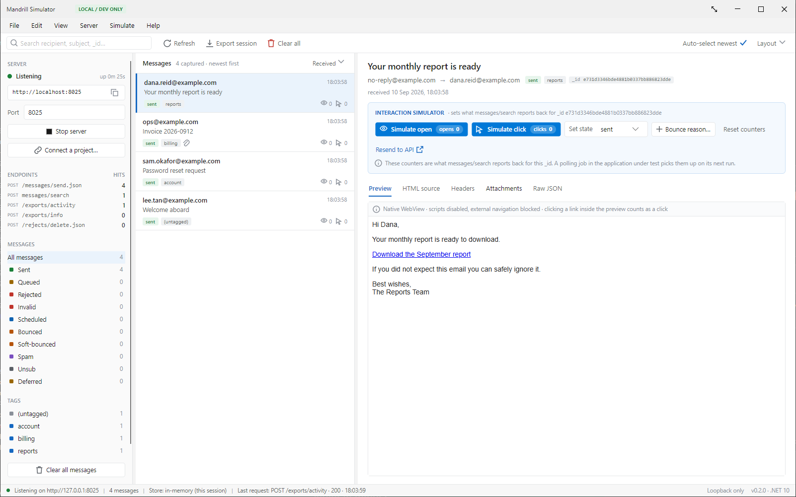

# Mandrill Simulator

A local desktop stand-in for the Mandrill (Mailchimp Transactional) HTTP API, so development and
testing never send real mail and never need a live account or key.

Point an application's Mandrill base URL at this app. It answers the same endpoints, captures every
message, and shows them in an inbox you can read, inspect and drive.



## Why not MailHog / Mailpit / smtp4dev?

Those are SMTP catchers. Mandrill's API is HTTP, so an application using the API sends no SMTP
traffic at all and an SMTP catcher sees nothing. This app speaks the HTTP API instead.

## What it implements

| Endpoint | Behaviour |
|---|---|
| `POST /messages/send.json` | Captures the message and answers with one result per recipient, each with its own `_id` |
| `POST messages/search` | Returns captured messages, filtered by `query`, `date_from`, `date_to`, `tags`, `senders`, `limit` |
| `POST /exports/activity` | Completes immediately and returns a `result_url` serving the activity CSV |
| `POST /exports/info` | Returns a previously created export job |
| `POST /rejects/delete.json` | Clears the reject state on messages for an address |

Details that matter if you are comparing against the real API:

- `status` is emitted lower-case (`sent`, `queued`, `rejected`, `invalid`, `scheduled`), because
  clients typically deserialise it into an enum.
- The `_id` minted on send is stable and is what `messages/search` reports back. This is what makes a
  polling job that reads `opens`/`clicks` testable — set the counters in the inbox and the next
  search reports them.
- Errors answer with Mandrill's error body (`status`, `code`, `name`, `message`); unknown paths are
  404, everything else a 500.
- Paths are normalised before routing. A client that builds its URL by concatenating a base ending in
  `/` with a path starting with `/` puts `//messages/send.json` on the wire, and an `/api/1.0/`
  prefix, a trailing slash or a missing `.json` are all accepted.

## Installing

Grab the latest [release](../../releases).

**Windows** — run `MandrillSimulator-win-Setup.exe`. It installs per user under
`%LocalAppData%\MandrillSimulator`, needs no administrator rights, and adds a Start Menu entry and an
uninstall entry. The build is not code-signed, so SmartScreen warns the first time: *More info* ▸
*Run anyway*.

**macOS and Linux — beta.** Those packages are built in CI but have not been installed or run on a
real machine yet.

A portable zip is attached to every release for anyone who would rather not install anything.

*Check for updates…* under Help updates an installed copy in place, straight from this repository's
releases. To point it elsewhere — a mirror, a file share — set `UpdateFeedUrl` (and
`UpdateFeedToken` if that feed needs one) in `%AppData%\MandrillSimulator\settings.json`.

## Requirements

Windows, macOS and Linux. The UI is [Avalonia](https://avaloniaui.net/), so one codebase covers all
three.

- [.NET 10 SDK or runtime](https://dotnet.microsoft.com/download) — or publish self-contained, below
- The HTML preview uses the platform's own web engine, nothing bundled:
  - **Windows** — WebView2 runtime (present on current Windows)
  - **macOS** — WKWebView, part of the OS
  - **Linux** — WebKitGTK: `sudo apt install libwebkit2gtk-4.1-0` (or your distro's equivalent).
    Without it, the app still runs and the Preview tab explains itself; the HTML source tab and
    every API behaviour are unaffected.

## Running it

```
dotnet run --project src/MandrillSimulator
```

The listener starts automatically on `http://localhost:8025/`. Change the port in the rail.

## Versioning

The git tag is the only place a release version is written. Tagging `v0.4.0` makes the release
workflow stamp the assembly and the installer with `0.4.0`, and the status bar reads it back from the
assembly at runtime — so the number cannot drift between what is installed and what the app claims.

Nothing increments it for you: pick the number when you tag. `<Version>` in the csproj is only the
fallback for local builds.

## Building the installers

CI does this on a tag (`.github/workflows/release.yml`), one runner per platform. By hand, for the
platform you are on:

```
dotnet tool install --global vpk --version 1.2.0
dotnet publish src/MandrillSimulator -c Release -r win-x64 --self-contained -o publish
vpk pack --packId MandrillSimulator --packVersion 0.3.0 --packDir publish --mainExe MandrillSimulator.exe --runtime win-x64 -o releases
```

The published folder is ~207 MB and the setup bundle compresses to ~54 MB.

**Do not add trimming.** The XAML uses reflection bindings, and the trimmer strips what they need
without failing the build — the app compiles, installs, and then falls apart at runtime.

## Pointing an application at it

Two ways, and neither is tied to any particular codebase.

**By hand.** Set whatever configuration key holds the Mandrill base URL to the URL in the rail
(`http://localhost:8025/`). Keep the trailing slash — most clients concatenate the path onto it.

**From the app.** *File > Connect a project…*, pick any JSON config file and give the key path
(colon or dot separated, e.g. `AppSetting:MandrillBaseUrl`). The simulator writes its URL there,
keeps a `.mandrillsim.bak` copy beside the file, and *Disconnect* restores the previous value. Any
missing levels in the key path are created.

If the application has no base-URL setting yet, add one and default it to the real Mandrill host, so
production behaviour is unchanged when the setting is absent.

## Driving a test

- **Simulate open / Simulate click** set what `messages/search` reports for that `_id`. Clicking a
  link inside the preview also counts as a click.
- **Set state** moves a message to `rejected`, `bounced`, `spam` and the rest, filling in a
  `reject_reason` or `bounce_description` so the caller sees a realistic failure.
- **Simulate > Fail the next API call** answers the next request with a 500 carrying Mandrill's error
  body, to exercise the caller's error path once.
- **Send sample message** posts a message to the listener from the app itself, to confirm the
  simulator works before wiring anything to it.

## Safety

The listener binds loopback only and the store is in memory, so captured mail never leaves the
machine and does not survive a restart. The preview renders captured HTML with scripts disabled and
external navigation blocked.

## Layout

The simulator proper is a plain `net10.0` library with no UI dependency, so it builds and is tested
on every platform; only the thin Avalonia layer above it draws anything.

```
src/MandrillSimulator.Core     net10.0 — no UI dependency
  Api/         HTTP listener, routing, one class per endpoint
  Store/       Captured messages and export jobs
  Models/      Message, attachment, settings types
  Services/    Config connector, settings, sample sender
src/MandrillSimulator          Avalonia desktop app
  ViewModels/  Inbox state and commands
  Themes/      Colour tokens and the icon set
  Converters/  Chip colours, file sizes, visibility
tests/                         Endpoint and path-normalisation tests
```

```
dotnet test
```

CI builds and runs the suite on Ubuntu, macOS and Windows — see `.github/workflows/build.yml`.
